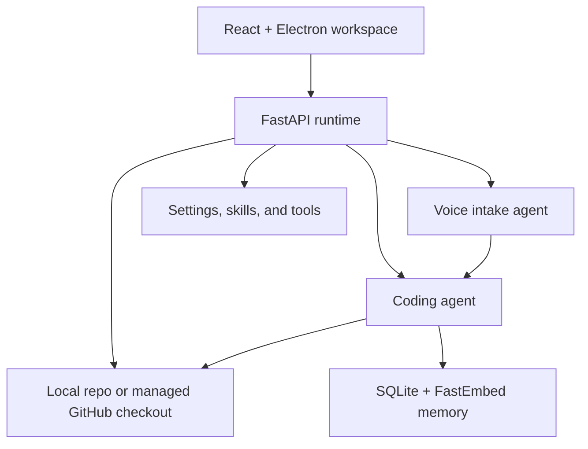
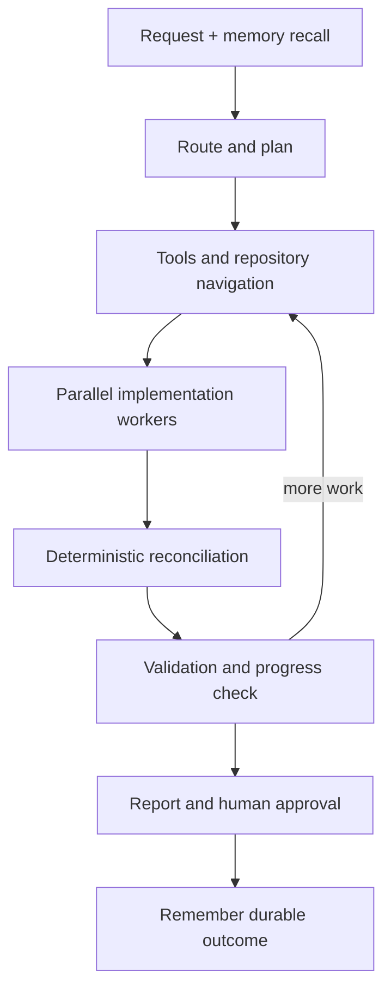

# NoDiff

NoDiff is a local-first desktop coding-agent harness built with LangGraph, FastAPI, React, TypeScript, and Electron. It turns a coding request into a repository-grounded plan, distributes implementation units across bounded workers, reconciles the proposed edits, runs validation, and keeps the final write behind an explicit human approval step.

> **Status: developer preview.** The coding and voice workflows, desktop interface, local repository access, managed GitHub workflow, model settings, skills/tools administration, and local memory are implemented. Distribution is still in progress: the current Electron build packages the UI shell, but it does not yet bundle or launch the Python backend as a production sidecar. There are no signed installers or published releases yet.

## What works today

- Open a local repository with the native desktop directory picker; NoDiff remembers the last valid local folder for the next launch.
- Import a GitHub repository into a backend-managed checkout, browse branches, and inspect repository status.
- Browse the repository tree and preview files in the desktop workspace.
- Submit typed tasks, attached text files, repository files, or supported images to the coding agent.
- Use voice input to gather context, ask targeted clarification questions, and hand a structured request to the coding workflow.
- Split broad work into dependency-aware implementation units and run a bounded number of coding-model workers concurrently.
- Use the reasoning model only for conditional reconciliation when worker proposals overlap.
- Review plans, implementation progress, diffs, validation results, and the final Markdown response as they stream over WebSocket.
- Approve or reject generated changes before they are copied from the isolated run sandbox into the selected repository.
- Commit only approved/applied agent files, then pull, push, and open a pull request from the Source Control view.
- Configure model providers, model IDs, credentials, worker limits, and token/context budgets from Agent Settings.
- Create or import Markdown skills, generate skill/tool drafts with AI, and review custom Python tools before approval.
- Persist coding checkpoints and durable repository memories locally with SQLite and FastEmbed.

## Current release readiness

| Area | Current state |
| --- | --- |
| Coding workflow | Implemented; divide-and-conquer workers, deterministic completion ledger, validation, and approval lifecycle are active |
| Voice workflow | Implemented; transcription, clarification, repository context, optional TTS, and coding-agent handoff are active |
| Local repositories | Implemented; native directory picker and last-folder restoration are active |
| GitHub workflow | Implemented; discovery, managed checkout, branches, pull, commit, push, and pull-request creation are active |
| Skills and tools | Implemented for coding and voice agents, including AI drafting, quarantine, review, approval, and bounded runtime use |
| Local memory | Implemented; SQLite retention, deduplication, consolidation, and periodic compaction are active |
| Electron installer | Experimental; Electron Builder targets are declared, but the Python backend is not bundled or started by the active Electron entrypoint |
| Public distribution | Not yet configured; signing, installer branding/assets, release automation, updates, and store submission remain |

## Architecture



The renderer never receives stored provider secrets or the GitHub token. HTTP requests use `x-api-key`. The current browser/Electron client authenticates its WebSocket with the API key query parameter; the backend also exposes a short-lived, single-use WebSocket-token endpoint for clients that opt into that flow.

### Coding-agent workflow



Key execution properties:

- Plans can contain up to 12 implementation units by default, independent of worker concurrency.
- Dependency-ready units are dispatched in bounded batches.
- Every implementation worker uses the coding-model slot.
- The reasoning-model slot is reserved for a bounded reconciliation pass when concurrent proposals conflict.
- A deterministic completion ledger tracks unit status, implementation attempts, and patch retries.
- Workers propose changes but do not mutate the selected repository directly.
- Generated changes are staged in an isolated sandbox, validated, and copied into the repository only after approval.
- Validation and incomplete units can trigger another repository-navigation/repair iteration.

## Repository layout

| Path | Purpose |
| --- | --- |
| `backend/pyproject.toml` | Python package metadata and runtime dependencies |
| `backend/src/agent_runtime/api/` | FastAPI application, authentication, schemas, and routers |
| `backend/src/agent_runtime/agents/coding/` | Coding graph, workers, reconciliation, validation, tools, skills, memory, and CLI |
| `backend/src/agent_runtime/agents/voice/` | Voice graph, provider clients, intake logic, skills, and approved-tool runtime |
| `backend/src/agent_runtime/config/` | Provider catalog, runtime configuration, paths, limits, and settings |
| `frontend/src/` | React desktop workspace and typed backend clients |
| `frontend/electron/` | Active Electron main/preload entrypoints and native directory-picker bridge |
| `frontend/pending_electron.ts` | In-progress sidecar-launch design; currently commented out and not used by the build |

NoDiff intentionally keeps the public product name separate from its internal Python package name, `agent_runtime`.

## Run from source

### Prerequisites

- Python 3.10 through 3.13
- [`uv`](https://docs.astral.sh/uv/)
- Node.js and npm (the repository does not currently pin a Node version)
- Git
- API credentials for the model providers you select

On Windows, run the Electron frontend and Python backend in the same Windows filesystem environment so the native directory picker and backend resolve identical repository paths.

### 1. Clone the repository

```bash
git clone https://github.com/KennanDG/NoDiff.git
cd NoDiff
```

### 2. Configure and start the backend

```bash
cd backend
uv sync
```

Create `backend/.env` with an API key for the local frontend and credentials for the providers you plan to use. The current default routing uses Groq for coding, vision, STT, and TTS, and DeepSeek for reasoning:

```env
AGENT_RUNTIME_API_KEY=replace-with-a-local-development-key

GROQ_API_KEY=...
DEEPSEEK_API_KEY=...

# Optional GitHub integration
GITHUB_TOKEN=...
GITHUB_TOKEN_KIND=user

# Optional tracing
LANGCHAIN_TRACING_V2=false
```

Then start FastAPI:

```bash
uv run python -m agent_runtime.api.main
```

The backend listens on `127.0.0.1:8765` by default. `/health`, `/docs`, and `/openapi.json` are public local endpoints; all other HTTP routes require `x-api-key`.

### 3. Configure and start the desktop frontend

In a second terminal:

```bash
cd NoDiff/frontend
npm ci
```

Create `frontend/.env.local`:

```env
VITE_AI_AGENTS_API_BASE=http://127.0.0.1:8765
VITE_AI_AGENTS_API_KEY=replace-with-the-same-local-development-key
```

The `VITE_AI_AGENTS_*` names are legacy compatibility variables that have not yet been renamed. Setting the base URL is currently required because the frontend fallback (`http://0.0.0.0:8000`) does not match the backend default port.

Start Vite and the Electron development shell:

```bash
npm run desktop:dev
```

The browser-accessible Vite UI can also be started with `npm run dev`, but local directory browsing requires the Electron preload bridge.

## Development checks

Backend:

```bash
cd backend
uv run ruff check src
uv run pytest src/agent_runtime/agents/coding/tests src/agent_runtime/agents/voice/tests
```

Frontend:

```bash
cd frontend
npm run typecheck
npm run build
```

The standalone coding CLI is available from `backend/`:

```bash
uv run python -m agent_runtime.agents.coding.main \
  --repo-root ../path/to/repository \
  --workspace-root ../path/to/repository \
  "Explain how validation is selected for this project"
```

CLI runs are dry-run by default. Add `--write` to permit writes, `--markdown-report` to save a report, or `--thread-id` to continue a checkpoint thread. The current CLI module initializes LangSmith configuration eagerly, so set `LANGCHAIN_API_KEY` before using it.

## Desktop packaging

The frontend declares Electron Builder targets for Windows (NSIS), macOS (DMG), and Linux (AppImage):

```bash
cd frontend
npm run desktop:build
```

This command currently builds and packages the Electron renderer/main process only. The active `frontend/electron/main.ts` provides the application window and native directory picker, but it does not launch a backend process. The `backend/` package is also absent from the current Electron Builder `files` list.

Before treating these artifacts as distributable applications, the packaging work still needs to:

1. Freeze or otherwise ship `nodiff-agent-runtime` as a platform-specific sidecar.
2. Start the sidecar on a loopback-only dynamic port with a per-launch API key.
3. Expose the runtime connection to the renderer through the context-isolated preload bridge.
4. Store memory, runtime settings, and GitHub workspaces under Electron's per-user `userData` directory.
5. Terminate the sidecar reliably when the desktop application exits.
6. Replace the remaining generic package metadata (`coding-agent-desktop`, `Coding Agent`, and `com.kennangauthier.codingagent`) with final NoDiff identifiers.
7. Add icons, versioning, code signing/notarization, installer metadata, release automation, update strategy, and Microsoft Store packaging.
8. Add clean-machine installation and upgrade tests for every supported platform.

## Model providers and settings

The Agent Settings modal supports capability-aware model selection and live model discovery when a credential is available.

| Slot | Supported providers |
| --- | --- |
| Coding | Groq, DeepSeek, OpenRouter, OpenAI, Anthropic, Google |
| Reasoning | Groq, DeepSeek, OpenRouter, OpenAI, Anthropic, Google |
| Vision/captioning | Groq, OpenRouter, OpenAI, Anthropic, Google |
| Voice chat | Groq, DeepSeek, OpenRouter, OpenAI, Anthropic, Google |
| Speech-to-text | Groq, OpenAI |
| Text-to-speech | Groq, OpenAI |

The modal also exposes the active divide-and-conquer limits, including worker concurrency, implementation-unit count, patch retries, repair iterations, routing/planning budgets, coding and reasoning context windows, output limits, and reconciliation budgets.

Provider credentials and the GitHub token entered in the UI are process/session-only. Secret values are never returned to the renderer. Non-secret model selections are persisted to `.agent-runtime/runtime-agent-config.json` by default.

Common environment variables:

```env
# Runtime API
AGENT_RUNTIME_HOST=127.0.0.1
AGENT_RUNTIME_PORT=8765
AGENT_RUNTIME_API_KEY=...
AGENT_RUNTIME_ALLOWED_ORIGINS=http://localhost:5173,http://127.0.0.1:5173

# Providers
GROQ_API_KEY=...
DEEPSEEK_API_KEY=...
OPENROUTER_API_KEY=...
OPENAI_API_KEY=...
ANTHROPIC_API_KEY=...
GOOGLE_API_KEY=...

# Model slots
CODING_PROVIDER=groq
CODING_MODEL=openai/gpt-oss-120b
REASONING_PROVIDER=deepseek
REASONING_MODEL=deepseek-v4-pro
CAPTION_PROVIDER=groq
CAPTION_MODEL=meta-llama/llama-4-scout-17b-16e-instruct
VOICE_CHAT_PROVIDER=groq
VOICE_CHAT_MODEL=llama-3.1-8b-instant
VOICE_STT_PROVIDER=groq
VOICE_STT_MODEL=whisper-large-v3-turbo
VOICE_TTS_PROVIDER=groq
VOICE_TTS_MODEL=canopylabs/orpheus-v1-english
```

Model availability changes over time. NoDiff prefers each provider's live model catalog and uses an internal fallback catalog only when live discovery is unavailable.

## Repository and GitHub workflow

NoDiff can operate on either a local directory or a managed GitHub checkout.

For managed repositories, the backend:

1. Lists repositories visible to the configured credential.
2. Clones or reuses the selected repository under `.agent-runtime/github-workspaces`.
3. Keeps branch-specific local work in internal Git stashes while switching branches.
4. Runs repository browsing, agent work, validation, and approval against that checkout.
5. Limits UI commits to files that the current agent run both generated and applied.

The GitHub token stays in the backend. HTTPS Git authentication is supplied through an ephemeral Git configuration header instead of being embedded in the clone URL.

Safety defaults include:

- Direct pushes to the repository default branch are disabled unless `GITHUB_ALLOW_DEFAULT_BRANCH_PUSH=true`.
- Push is rejected when the remote branch contains commits that are not present locally.
- Commit paths must stay within the managed checkout and must already be changed.
- Commits are limited to 100 files and 5 MB per file by default.
- Secret-like paths such as `.env`, private keys, credential files, and secret files are blocked by default.
- Pull-request creation requires a clean working tree and a pushed head branch.

A fine-grained personal access token is suitable for a local single-user installation. Grant only the repository access required: Contents read access for inspection, Contents write access for commit/push, and Pull requests write access when creating PRs.

## Skills and custom tools

Both the coding and voice agents have disk-backed Markdown skill registries. Custom skills can be authored manually, imported and normalized from Markdown, or drafted with the configured coding model. A skill can declare only tool names that are executable for its agent.

Custom Python tools follow a stricter lifecycle:

1. AI-generated or uploaded source enters `custom_pending` quarantine.
2. The backend validates its syntax, public function contract, imports, and disallowed dynamic/file/process operations.
3. The full source and validation result are presented for human review.
4. Approval loads the candidate through the appropriate coding or voice registry before atomically moving it into `custom_approved`.
5. Runtime invocation is bounded by tool-call and output limits and receives backend-owned repository context.

Custom tool validation is defense in depth, not an operating-system sandbox. Approved tools execute inside the local backend process and should be reviewed as executable code.

## Local memory

Coding-agent persistence is local and does not require Postgres or an external vector database.

Default paths:

```text
.agent_runtime/memory/checkpoints.sqlite3
.agent_runtime/memory/store.sqlite3
.agent_runtime/memory/fastembed-cache/
```

- Checkpoints preserve thread-scoped graph state.
- The store keeps compact cross-thread outcomes scoped by user, namespace, and stable repository identity.
- `BAAI/bge-small-en-v1.5` provides local 384-dimensional semantic embeddings by default.
- Maintenance runs opportunistically when persistence opens.
- Inactive checkpoint threads are pruned after 30 days or beyond 100 retained threads by default.
- Durable memories are retained for up to 365 days and capped at 300 items per repository namespace, while preserving a minimum recent set.
- Exact duplicates are removed and high-confidence near-duplicates can be consolidated.
- Periodic WAL checkpointing and `VACUUM` reclaim SQLite space after pruning.

## API surface

| Prefix | Purpose |
| --- | --- |
| `/health` | Runtime health check |
| `/coding-agent` | Repository tree/file reads, WebSocket token, and streamed coding runs |
| `/voice-agent` | Multipart voice turns and coding-request handoff |
| `/github` | Connection, repository, branch, pull, commit, push, and pull-request operations |
| `/admin` | Local repository session, model settings/catalogs, skills, and custom tools |

Interactive API documentation is available at `http://127.0.0.1:8765/docs` while the backend is running.

## Security model

NoDiff is currently a local, single-user developer tool, not a hardened multi-tenant execution service.

- Bind the backend to loopback unless you have added an appropriate network security layer.
- Use a strong runtime API key even during desktop development.
- Give provider and GitHub credentials the minimum permissions necessary.
- Keep `.env` and generated local state out of source control.
- Review every generated diff and every custom tool before approval.
- Treat shell commands, repository validation, approved tools, and model-generated code as local code execution.
- Production distribution should add stronger process isolation, auditability, secure credential storage, and platform-specific sandboxing.

## Near-term roadmap

- [x] Migrate the coding, voice, API, configuration, and frontend code into the standalone repository.
- [x] Replace the legacy Python import namespace with `agent_runtime`.
- [x] Add divide-and-conquer implementation workers and conditional reasoning reconciliation.
- [x] Add local SQLite/FastEmbed memory with retention and consolidation.
- [x] Add local-directory restoration and a Windows-native folder picker.
- [x] Add provider-aware model discovery, Google endpoint normalization, and GitHub credentials in Agent Settings.
- [x] Add coding and voice skill/tool generation, review, approval, and runtime integration.
- [ ] Complete Python sidecar bundling and lifecycle management.
- [ ] Finish NoDiff product metadata, icons, and installer resources.
- [ ] Add signed Windows installers and Microsoft Store packaging.
- [ ] Add macOS notarization and Linux distribution validation.
- [ ] Add CI release builds, checksums, and upgrade testing.
- [ ] Remove or formally deprecate the remaining legacy `VITE_AI_AGENTS_*` compatibility names.
- [ ] Harden custom-tool and shell execution boundaries before any multi-user deployment.

## License

Licensed under the [Apache License 2.0](LICENSE).
