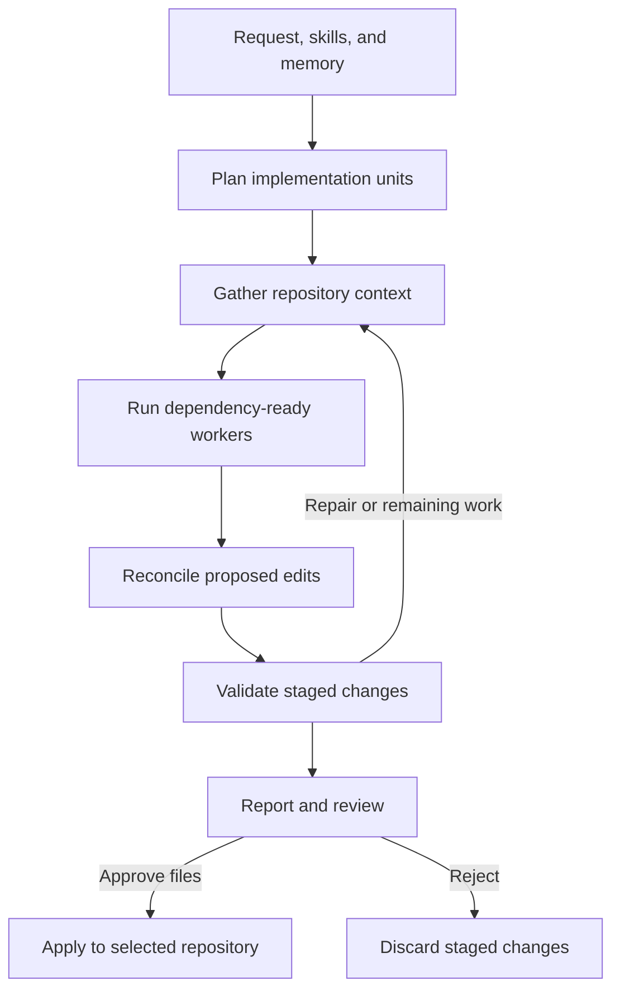

# NoDiff

NoDiff is a desktop coding and voice assistant built with Electron, React, TypeScript, FastAPI, and LangGraph. It turns a request into a repository-aware plan, proposes changes through bounded implementation workers, runs validation, and lets you review and approve files before applying them to your repository.

## Current capabilities

| Area             | Implemented behavior                                                                                                                                                   |
| ---------------- | ---------------------------------------------------------------------------------------------------------------------------------------------------------------------- |
| Workspace        | Native local-folder picker, restoration of the last valid local folder, repository tree, file previews, and attached text files or images                              |
| Coding           | Repository search, multi-skill routing, planning, dependency-aware implementation units, bounded concurrent workers, reconciliation, validation, and repair iterations |
| Review           | Streamed progress and reports, code editor diffs, dry runs, and approval or rejection of staged files                                                                 |
| Voice            | Audio transcription, conversational clarification, repository/attachment context, optional speech output, and handoff to the coding agent                              |
| Source control   | GitHub repository discovery/import, managed checkouts, branch selection/creation, status, pull, commit, push, and pull-request creation                                |
| Settings         | Provider/model selection, live model discovery with fallback catalogs, execution budgets, and credentials for providers, GitHub, and SerpApi                           |
| Skills and tools | Built-in coding/voice resources, custom Markdown skills, AI-generated drafts, and custom Python tool review, approval, editing, and deletion                           |
| Persistence      | Local graph checkpoints, repository-scoped durable memory, retention/deduplication, saved settings, and encrypted desktop credential storage                           |

### File types and validation

The patch writer creates and edits UTF-8 text files; it is not limited to Python or TypeScript. Examples include JavaScript, HTML/CSS, Markdown, JSON/YAML/TOML/XML, SQL, PowerShell, shell scripts, and source files for other languages. Repository search recognizes an expanded [text-extension list](backend/src/agent_runtime/agents/coding/utils/constants.py) and can also inspect unknown extensions that pass its UTF-8 text check.

The patch pipeline does not generate binary assets. Protected paths, dependency directories, build outputs, selected environment files, and lockfiles remain restricted by the [write-path rules](backend/src/agent_runtime/agents/coding/utils/patch.py). Language support for editing is broader than automatic validation: Python tests/lint and limited frontend checks exist, but every language does not have a dedicated validator. Check the reported commands and results for each run.

## Run the desktop app from source

### Prerequisites

NoDiff development is currently Windows-focused. Install the following tools before cloning the repository:

- Python **3.10–3.13**; the Windows packaging workflow uses Python **3.13**.
- [`uv`](https://docs.astral.sh/uv/) for Python dependency and virtual-environment management.
- Node.js **22** and npm.
- Git on `PATH` for repository operations.
- Credentials for the model providers you choose. GitHub and SerpApi credentials are needed only for their respective integrations.

#### 1. Install Python

The recommended version for Windows development and packaging is **Python 3.13**.

Using Windows Package Manager:

```powershell
winget install --exact --id Python.Python.3.13
```

Close and reopen PowerShell, then verify the installation:

```powershell
python --version
```

If `python` is not recognized but the Python launcher is available, check with:

```powershell
py -3.13 --version
```

You can also download Python from [python.org](https://www.python.org/downloads/). During the installer, enable **Add python.exe to PATH**.

#### 2. Install uv

Install `uv` from PowerShell with the official installer:

```powershell
powershell -ExecutionPolicy ByPass -c "irm https://astral.sh/uv/install.ps1 | iex"
```

Close and reopen PowerShell, then verify:

```powershell
uv --version
```

See the [`uv` installation guide](https://docs.astral.sh/uv/getting-started/installation/) for alternative installation methods.

#### 3. Install Node.js and npm

NoDiff currently uses **Node.js 22**. npm is included with Node.js.

The easiest way to install and manage the required Node version on Windows is with [nvm-windows](https://github.com/coreybutler/nvm-windows):

```powershell
winget install --exact --id CoreyButler.NVMforWindows
```

Close and reopen PowerShell, then install and activate Node.js 22:

```powershell
nvm install 22
nvm use 22
```

Verify both Node.js and npm:

```powershell
node --version
npm --version
```

Alternatively, install a Node.js 22 release directly from the [Node.js downloads page](https://nodejs.org/en/download).

#### 4. Install Git

Install Git for Windows:

```powershell
winget install --exact --id Git.Git
```

Close and reopen PowerShell, then verify:

```powershell
git --version
```

You can also download the installer from [git-scm.com](https://git-scm.com/download/win).

#### 5. Verify all prerequisites

Before setting up NoDiff, confirm that the required commands are available:

```powershell
python --version
uv --version
node --version
npm --version
git --version
```

For Windows development, run Node, Electron, `uv`, and Python in the same native Windows environment so repository paths match. Windows x64 is the configured packaged target.

```powershell
git clone https://github.com/KennanDG/NoDiff.git
cd NoDiff/backend
uv sync --frozen
cd ../frontend
npm ci
npm run desktop:dev
```

Electron starts the backend automatically with `uv run python -m agent_runtime.api.main`, waits for `/health`, and opens the desktop window. It selects a loopback port, creates a runtime API key if one was not supplied, and passes the connection through the preload bridge. A separate backend terminal and `VITE_AI_AGENTS_*` environment configuration are not needed for this desktop flow.

Open **Agent Settings** to enter credentials and choose models, then select a local repository or import one from GitHub. The repository defaults use Groq for coding, vision, voice chat, STT, and TTS, with DeepSeek for reasoning; change these slots if you use other providers.

The first memory initialization may download the local embedding model. If startup fails or exceeds the desktop readiness timeout, use the [memory diagnostic commands](backend/README.md#memory-and-diagnostics) to initialize/check the cache before retrying.

Both `npm run dev` and `npm run desktop:dev` invoke the Electron-enabled Vite configuration. The current renderer depends on `window.desktop`; a standalone browser tab is not a complete supported client. For a separately launched API, follow the [backend guide](backend/README.md#run-the-api-directly).

## How a coding run works



The default execution profile allows **3 concurrent workers** and **up to 12 implementation units**. Workers use the coding-model slot; conflicting proposals can trigger a bounded reasoning-model reconciliation. The completion ledger tracks units, retries, and remaining work.

The desktop/API workflow stages writable runs in a temporary copy of the workspace. Only approved file changes are copied back. Dry runs report proposals without writing or validating the proposed changes. Progress, validation output, reports, and approval events reach the UI over WebSocket.

This workspace copy is not an operating-system security sandbox. Validation commands and approved custom Python tools execute locally with the backend's privileges. The standalone CLI also has a different write lifecycle; see its [CLI notes](backend/README.md#standalone-coding-cli).

## Providers and configuration

| Model slot           | Providers supported by the configuration              |
| -------------------- | ----------------------------------------------------- |
| Coding and reasoning | Groq, DeepSeek, OpenRouter, OpenAI, Anthropic, Google |
| Vision/captioning    | Groq, OpenRouter, OpenAI, Anthropic, Google           |
| Voice chat           | Groq, DeepSeek, OpenRouter, OpenAI, Anthropic, Google |
| Speech-to-text       | Groq, OpenAI                                          |
| Text-to-speech       | Groq, OpenAI                                          |

Agent Settings exposes model IDs, provider catalogs, worker/iteration limits, and token/context budgets. Actual model availability depends on the provider account; configuration support is not a guarantee that a particular model is available. Built-in web search uses `SERPAPI_API_KEY`.

Desktop credentials saved through Agent Settings are encrypted with Electron `safeStorage`, written to `runtime-secrets.json`, and loaded into the backend environment on later launches. Saving persistent credentials requires OS-backed encryption to be available. Settings responses expose whether credentials are configured, not their saved values. For direct API use, credential updates are session-only; use environment variables or `backend/.env` for later launches.

The current FastAPI entrypoint explicitly disables LangSmith tracing, including when tracing variables are inherited from the shell. Normal desktop/API operation does not require a LangSmith key.

## Local data and memory

The desktop uses one writable runtime root, separate from the installation and selected repository:

| Platform                 | Default runtime root                                   |
| ------------------------ | ------------------------------------------------------ |
| Windows                  | `%APPDATA%\NoDiff\agent-runtime`                     |
| macOS source development | `~/Library/Application Support/NoDiff/agent-runtime` |
| Linux source development | `${XDG_CONFIG_HOME:-~/.config}/NoDiff/agent-runtime` |

Set `AGENT_RUNTIME_DATA_DIR` before launching Electron to choose another root. Agent Settings displays the resolved directory; Windows package virtualization can affect its physical location.

| Path under the desktop runtime root                         | Contents                                          |
| ----------------------------------------------------------- | ------------------------------------------------- |
| `runtime-agent-config.json`                               | Non-secret provider/model selections              |
| `runtime-agent-config-coding-runtime.json`                | Coding execution limits and budgets               |
| `runtime-secrets.json`                                    | Encrypted desktop credentials                     |
| `local-repository-session.json`                           | Last valid local repository                       |
| `github-workspaces/`                                      | Managed GitHub checkouts                          |
| `memory/checkpoints.sqlite3` and `memory/store.sqlite3` | Graph checkpoints and durable repository memories |
| `memory/fastembed-cache/` and `memory/maintenance.json` | Local embedding model cache and maintenance state |
| `agents/coding/` and `agents/voice/`                    | Custom skills and pending/approved tools          |
| `logs/`                                                   | Backend and desktop diagnostics                   |

Memory uses SQLite and FastEmbed, with `BAAI/bge-small-en-v1.5` as the default 384-dimensional embedding model. It does not require Postgres or a hosted vector database. Retention, duplicate consolidation, checkpoint pruning, and periodic SQLite compaction are implemented; details are in the [backend guide](backend/README.md#memory-and-diagnostics).

Local storage does not make model execution offline. Requests, selected repository context, attachments, and audio may be sent to the configured providers; GitHub and web search also use external services.

## Repository and GitHub workflow

Local mode works against a selected folder. GitHub mode clones or reuses a checkout beneath `github-workspaces/` and preserves branch-specific local changes with internal Git stashes when switching branches.

The Source Control UI limits commits to changed files applied from the current agent run. Backend checks also enforce repository-contained paths, blocked sensitive filenames, and default limits of 100 files and 5 MB per file. Direct pushes to a repository's default branch are disabled unless `GITHUB_ALLOW_DEFAULT_BRANCH_PUSH=true`; pushes are rejected when the remote is ahead. Pull-request creation requires a clean checkout and a pushed head branch.

Provide a GitHub token with access to the repositories and operations you need. The backend supplies Git credentials through a temporary configuration header rather than embedding the token in clone URLs. Git itself must be installed separately, including when using a packaged desktop build.

## Skills and custom tools

Coding and voice agents load bundled Markdown skills and custom overlays from writable user data. The Skills UI supports manual authoring, Markdown import/normalization, AI drafting, and tool administration.

Custom Python tools enter `custom_pending` for review and move to `custom_approved` after validation and approval. The current validator checks Python syntax and a compatible synchronous entry function. Standard-library imports, installed third-party packages, existing NoDiff tools, and helper functions/classes are supported. Powerful operations and import-time execution produce review warnings rather than blanket source-policy rejection.

Approved tools execute in the backend process. Their dependencies must exist in that runtime; the packaged app does not install arbitrary new packages when a tool is approved. The [backend guide](backend/README.md#skills-and-tool-contract) describes the callable contract and storage paths.

## Development checks

From `backend/`:

```powershell
uv run ruff check src tests
uv run pytest tests src/agent_runtime/agents/coding/tests src/agent_runtime/agents/voice/tests
```

The explicit test paths include both top-level memory tests and agent tests; plain `pytest` uses only `tests/` from `pyproject.toml`.

From `frontend/`:

```powershell
npm run typecheck
npm run build
```

These are contributor check commands, not a claim that every check currently passes. The frontend has no `npm test` script. The Windows workflow currently runs the frontend type check and packaging, not the backend test suite.

## Repository layout

| Path                                                                                    | Purpose                                                                    |
| --------------------------------------------------------------------------------------- | -------------------------------------------------------------------------- |
| [`backend/src/agent_runtime/api/`](backend/src/agent_runtime/api/)                     | FastAPI entrypoint, authentication, schemas, and routers                   |
| [`backend/src/agent_runtime/agents/coding/`](backend/src/agent_runtime/agents/coding/) | Coding graph, workers, patching, validation, skills/tools, memory, and CLI |
| [`backend/src/agent_runtime/agents/voice/`](backend/src/agent_runtime/agents/voice/)   | Voice graph, provider clients, intake, and tools                           |
| [`backend/src/agent_runtime/config/`](backend/src/agent_runtime/config/)               | Settings, provider catalogs, paths, and tracing bootstrap                  |
| [`backend/nodiff-agent-runtime.spec`](backend/nodiff-agent-runtime.spec)               | Windows PyInstaller sidecar definition                                     |
| [`frontend/src/`](frontend/src/)                                                       | React workspace and typed API/WebSocket clients                            |
| [`frontend/electron/`](frontend/electron/)                                             | Active desktop main process and preload bridge                             |
| [`frontend/electron-builder.store.cjs`](frontend/electron-builder.store.cjs)           | MSIX identity and packaging configuration                                  |

The public product name is **NoDiff**; the Python import package remains `agent_runtime` and the internal npm package name remains `coding-agent-desktop`.

## License

Licensed under the [Apache License 2.0](LICENSE).
